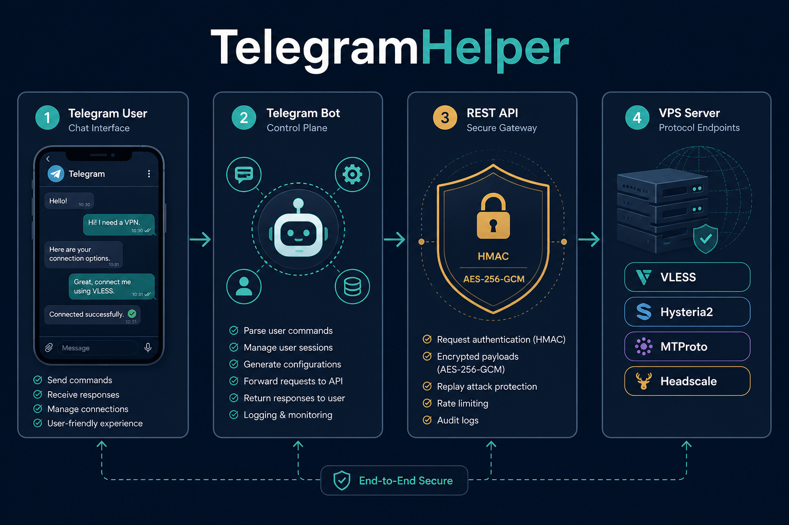
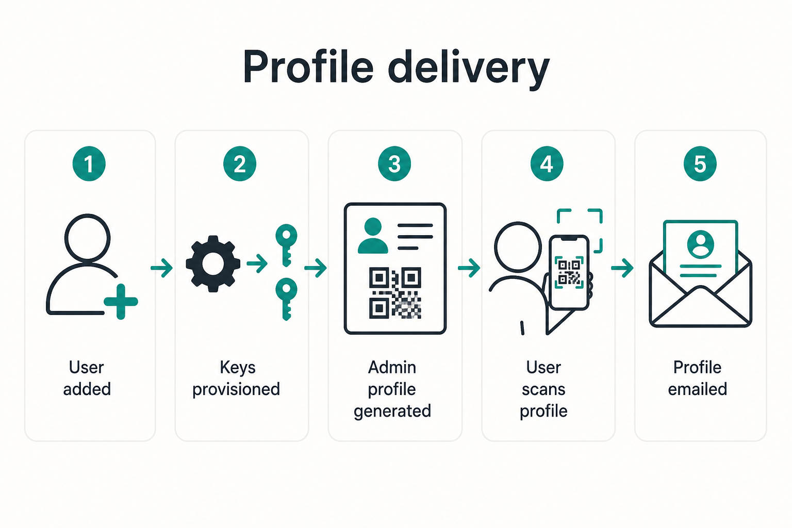
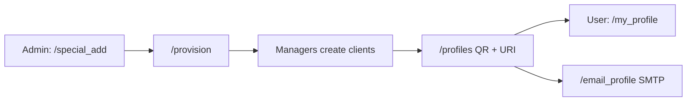
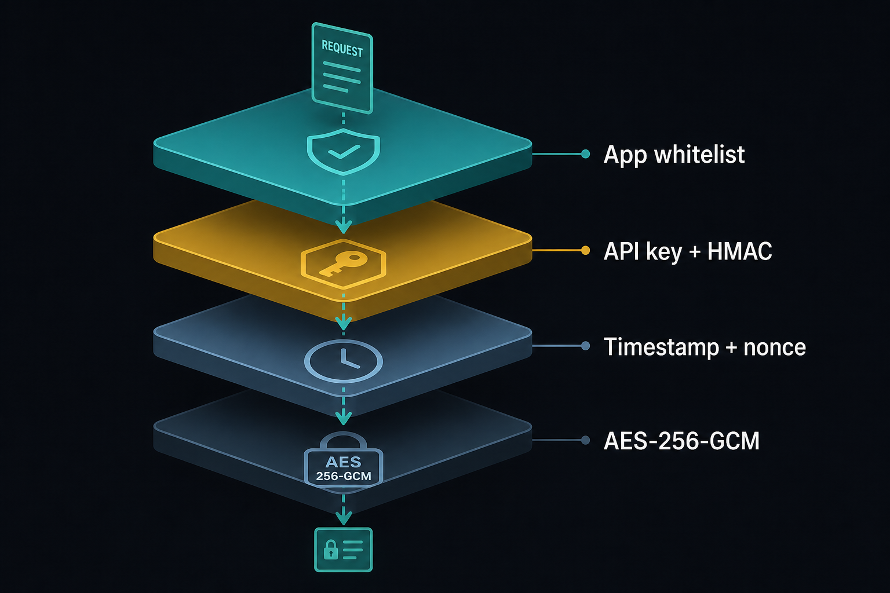
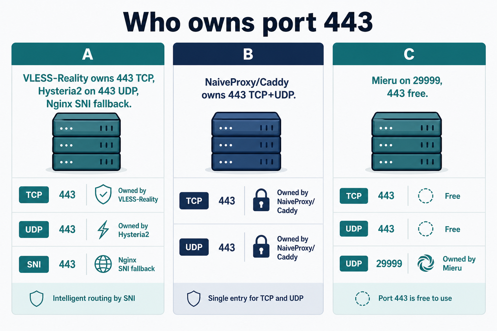
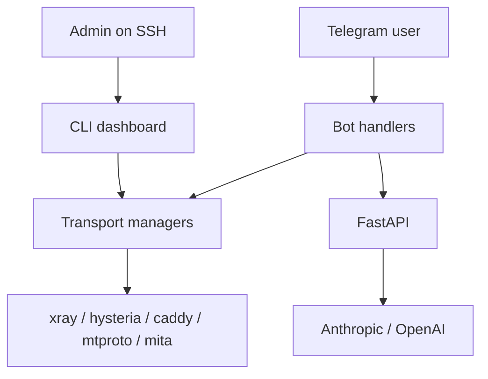

# TelegramHelper

Self-hosted **Telegram bot + REST API + VPN profile manager** for a VPS.

Operators manage the server from Telegram (or an SSH CLI). Users receive
VLESS, Hysteria2, MTProto and other profiles as URI, QR, or email.
A FastAPI service exposes AI queries behind API keys, HMAC, and AES-256-GCM.



## What you get

- Telegram control plane with admin guards and a role-aware command menu
- Unified provisioning: `/special_add` → `/provision` → `/profiles` / `/my_profile` / `/email_profile`
- Transports: VLESS-Reality, Hysteria2, MTProto, NaiveProxy, Mieru, TUIC, AnyTLS, XHTTP
- Optional 3x-ui as the source of truth for inbound clients
- Headscale / Headplane mesh and an exit-node helper
- Dockhand (Streamlit) for Docker diagnostics over an SSH tunnel
- AI chat (`/ai`), translation (`/tr`, `/tr_ai`, `/ru` `/en` `/fr`), and `/prompt`
- Encrypted REST API compatible with AES-256-GCM desktop clients

This public tree is a sanitized community edition. Keep real VPS inventory,
tokens, and host-specific runbooks in a private repo.

## Quick start (local)

```bash
python3 -m venv venv
source venv/bin/activate
pip install -r requirements.txt
cp example.env .env
# fill BOT_TOKEN, ADMIN_USER_IDS, and optional AI keys
python3 main.py
```

Modes:

- `python3 main.py` — bot + API
- `python3 main.py --api-only` — API only
- `python3 main.py --bot-only` — bot only

## Install on a VPS

```bash
git clone https://github.com/kureinmaxim/TelegramHelper.git TelegramHelper
cd TelegramHelper
sudo bash scripts/install_telegramhelper_vps.sh
```

Then edit `.env` and restart:

```bash
sudo systemctl restart telegramhelper
```

Full install path: [DEPLOY.md](DEPLOY.md). After `git pull` on an existing
host: [POST_DEPLOY.md](POST_DEPLOY.md). First-hour checklist: [START_HERE.md](START_HERE.md).

## How profiles are delivered



```text
/special_add 123456789
/provision 123456789
/profiles 123456789
/my_profile          # the user fetches URI + QR (auto-delete after 15 minutes)
/email_profile 123456789
```



Details: [QR_CLIENT_ONBOARDING.md](QR_CLIENT_ONBOARDING.md).

## Security layers



| Layer | Role |
| --- | --- |
| Telegram admin IDs | Control-plane auth (`ADMIN_USER_IDS`) |
| App whitelist | Only listed `APP_ID` values may call the API |
| API key + HMAC | Request authenticity |
| Timestamp + nonce | Replay protection |
| AES-256-GCM | Encrypted `/ai_query` bodies |

Never commit `.env`, `app_keys.json`, `*_config.json`, or Gmail OAuth files.
See [SECURITY.md](SECURITY.md).

## Who owns port 443?



Only one TLS service can own `443/tcp`. Pick before install:

| Scenario | 443/TCP | 443/UDP | Notes |
| --- | --- | --- | --- |
| **VLESS-Reality** | Xray (fallback to Nginx :8443) | Hysteria2 QUIC | Can share 443 with Headscale via SNI |
| **NaiveProxy** | Caddy + Let's Encrypt | Caddy HTTP/3 | Needs a real domain |
| **Mieru** | Free by default | Free by default | Default listen is `29999` |

Decision table: [DEPLOY.md](DEPLOY.md).

## Architecture (short)



More: [ARCHITECTURE.md](ARCHITECTURE.md).

## Documentation

Project docs only — no generic tutorials.

| Doc | When to read |
| --- | --- |
| [START_HERE.md](START_HERE.md) | First hour on a new VPS |
| [DEPLOY.md](DEPLOY.md) | Installer, port 443, `.env` |
| [POST_DEPLOY.md](POST_DEPLOY.md) | `git pull` and Docker recreate |
| [ARCHITECTURE.md](ARCHITECTURE.md) | Modules and request flow |
| [SECURITY.md](SECURITY.md) | Secrets, keys, QR TTL |
| [DOCKER.md](DOCKER.md) | Compose services |
| [QR_CLIENT_ONBOARDING.md](QR_CLIENT_ONBOARDING.md) | Deliver a user profile |
| [EMAIL.md](EMAIL.md) | SMTP for `/email_profile` |
| [SSHvsTelegramBOT.md](SSHvsTelegramBOT.md) | CLI dashboard when Telegram is down |
| [HEADSCALE_GUIDE.md](HEADSCALE_GUIDE.md) | Headscale / Headplane |
| [DOCKHAND_GUIDE.md](DOCKHAND_GUIDE.md) | Docker diagnostics UI |
| [RCLONE_VPS.md](RCLONE_VPS.md) | Offsite backup |

Transports: [VLESS_GUIDE.md](VLESS_GUIDE.md), [HYSTERIA2_GUIDE.md](HYSTERIA2_GUIDE.md), [MTPROTO_CHEATSHEET.md](MTPROTO_CHEATSHEET.md), [NAIVEPROXY_GUIDE.md](NAIVEPROXY_GUIDE.md), [MIERU_GUIDE.md](MIERU_GUIDE.md), [NGINX_SNI_ROUTING.md](NGINX_SNI_ROUTING.md).

## License

MIT. Copyright TelegramHelper contributors.
